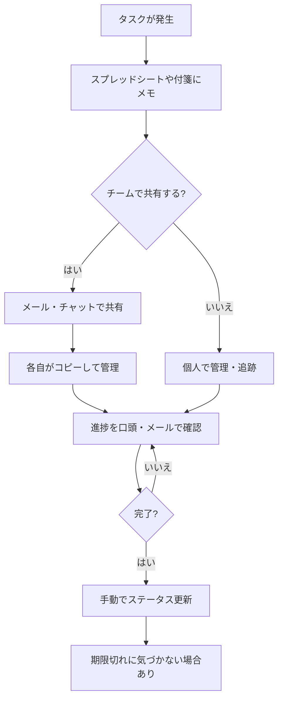
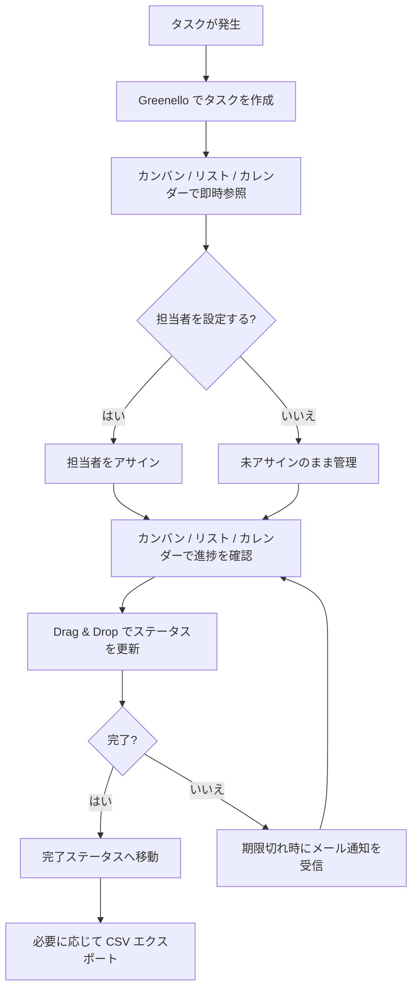

# 業務フロー図

## As-Is（現状フロー）

ツールなし・スプレッドシート・付箋など個人ごとに異なる手段でタスクを管理している状態。

## To-Be（あるべき姿）

Greenello を使い、チームが一つのボードでタスクを共同管理する状態。

## 変更点サマリー

| 項目 | As-Is | To-Be |
|-----|-------|-------|
| タスク管理方法 | スプレッドシート・付箋・メモ（個人ごとに異なる） | Greenello ボードに一元管理 |
| タスク管理場所 | 個人ごとにバラバラ | Greenello ボードに一元化 |
| 進捗確認 | 口頭・メールで都度確認 | カンバン / リスト / カレンダーで即時確認 |
| ステータス更新 | 手動で書き換え | Drag & Drop で直感的に更新 |
| 期限管理 | 見落としが発生しやすい | 期限切れタスクをメールで自動通知 |
| データ出力 | 手作業でフォーマット整形 | 任意条件で CSV エクスポート |
