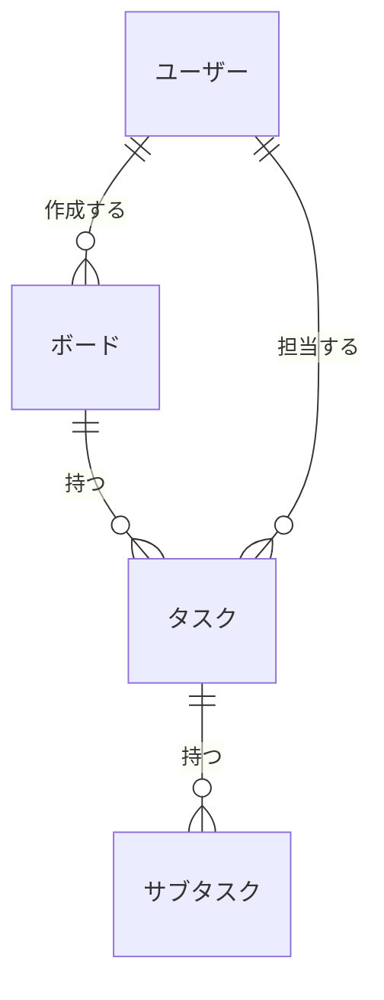

# 概念データモデル（ER図）

## エンティティ一覧

| エンティティ名 | 概要 |
|-------------|------|
| ユーザー | アカウントを持つ利用者。ボードの作成・タスク操作を行う |
| ボード | タスクをまとめる単位。作成者（オーナー）のみがアクセスできる |
| タスク | ボードに属する作業単位。ステータス・期限・優先度などを持つ |
| サブタスク | 親タスクに紐付く子タスク。2階層のみ（親→サブタスク）|

## 概念ER図

## 主要リレーション

| エンティティA | 関係 | エンティティB | 説明 |
|------------|-----|------------|------|
| ユーザー | 1:N | ボード | ユーザーは複数のボードを作成できる |
| ボード | 1:N | タスク | ボードは複数のタスクを持つ |
| タスク | 1:N | サブタスク | 親タスクは複数のサブタスクを持つ（最大2階層） |
| ユーザー | 1:N | タスク | ユーザーは複数のタスクに担当者としてアサインされる |
