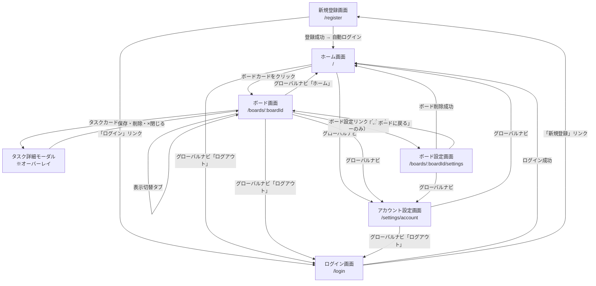

# 画面遷移図

## 遷移フロー

## 画面一覧

| 画面名 | 説明 |
|-------|------|
| 新規登録画面 | メールアドレスとパスワードで新規アカウントを作成 |
| ログイン画面 | メールアドレスとパスワードでログイン。「新規登録」リンクあり |
| ホーム画面 | 自分のボード一覧を表示。ボードの作成を行う |
| アカウント設定画面 | パスワード変更を行う |
| カンバン表示 | ステータス別カラムにタスクカードを表示。Drag & Drop で移動可能 |
| リスト表示 | タスクを一覧テーブルで表示。ソート・フィルター対応 |
| カレンダー表示 | 期限日をカレンダー上にタスクとして表示 |
| 進捗サマリー表示 | タスクの進捗をグラフ化して可視化 |
| タスク詳細モーダル | タスクの作成・編集・削除・サブタスク管理・担当者アサインを行う |
| ボード設定画面 | ボード削除を行う。ボードオーナーのみアクセス可能 |

## 遷移条件一覧

| 遷移元 | 遷移先 | 条件・トリガー |
|-------|-------|--------------|
| 新規登録画面 | ホーム画面 | 登録成功（自動ログイン） |
| 新規登録画面 | ログイン画面 | 「ログイン」リンクをクリック |
| ログイン画面 | ホーム画面 | ログイン成功 |
| ログイン画面 | 新規登録画面 | 「新規登録」リンクをクリック |
| ホーム画面 | ボード画面 | ボードカードをクリック |
| ホーム画面 | アカウント設定画面 | グローバルナビからアクセス |
| ホーム画面 | ログイン画面 | ログアウト操作 |
| ボード画面 | タスク詳細モーダル | タスクカードをクリック（オーバーレイ表示） |
| ボード画面 | ボード設定画面 | 設定リンクをクリック（ボードオーナーのみ表示） |
| ボード画面 | アカウント設定画面 | グローバルナビからアクセス |
| ボード画面 | ホーム画面 | グローバルナビのホームリンク |
| タスク詳細モーダル | ボード画面 | 保存・削除・×ボタンで閉じる |
| ボード設計画面 | ホーム画面 | ボード削除成功後 |
| ボード設定画面 | ボード画面 | 「← ボードに戻る」リンク |
| 任意の認証必要画面 | ログイン画面 | 未認証・セッション切れでアクセスした場合 |

## アクセス制御ルール

| 画面 | 未認証 | 認証済み（非オーナー） | ボードオーナー |
|-----|-------|--------------------|--------------|
| 新規登録・ログイン | ○ | ログイン後リダイレクト | ログイン後リダイレクト |
| ホーム画面 | → ログイン | ○（自分のボードのみ表示） | ○ |
| ボード画面 | → ログイン | 403 | ○ |
| ボード設定画面 | → ログイン | 403 | ○ |
| アカウント設定画面 | → ログイン | ○ | ○ |
