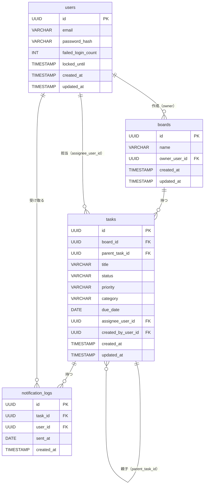

# 論理ER図

## エンティティ一覧

| エンティティ名 | テーブル名 | 概要 |
|-------------|---------|------|
| ユーザー | users | 登録ユーザーの認証情報 |
| ボード | boards | タスク管理の単位。作成者のみがアクセスできる |
| タスク | tasks | ユーザーが管理する作業単位。サブタスクも同テーブル |
| 通知送信履歴 | notification_logs | 期限切れタスクへの通知送信記録（重複送信防止） |

## ER図

## リレーションシップ説明

| リレーション | カーディナリティ | 説明 |
|-----------|--------------|------|
| users → boards | 1対多 | ユーザーは複数のボードをオーナーとして作成できる |
| boards → tasks | 1対多 | ボードは複数のタスクを持つ |
| tasks → tasks | 1対多 | タスクは複数のサブタスクを持つ（2階層まで） |
| users → tasks | 1対多 | ユーザーは複数のタスクの担当者になれる |
| tasks → notification_logs | 1対多 | タスクは複数の通知履歴を持つ |
| users → notification_logs | 1対多 | ユーザーは複数の通知履歴を受け取る |
